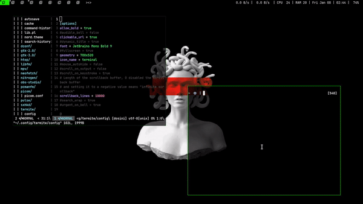

### Medusa 

Medusa is a dwm rice which is simple and aesthetic with no complexity!

- minimal setup with less bloat
- cool setup for a low-end spec hardware 
- comes along with some base install [scripts](https://github.com/Mr-Mittens/Medusa/tree/main/scripts)
- pure black GTK [theme](https://github.com/Mr-Mittens/Medusa/tree/main/black-GTK/sample) added.
- vim scripts added avoiding bloated plugins

**setting up**

- **base install**

- clone the whole repo and cd into [scripts](https://github.com/Mr-Mittens/Medusa/tree/main/scripts)
- make [basefull.sh](ttps://github.com/Mr-Mittens/Medusa/blob/main/scripts/basefull.sh) executable.

   chmod +x basefull.sh (this is not for legacy-hardware rather choose [this](https://github.com/Mr-Mittens/arch-install))
       
      ./basefull.sh
      
- run [baresetup.sh](https://github.com/Mr-Mittens/Medusa/blob/main/bare-setup.sh) after making it executable for setting up wm 
    
      ./baresetup.sh

**patches**

- center
- alpha
- fullgaps
- notitle

**basic key-bindings**

`Mod+x` - terminal

`Mod+q` - close working window

`Mod+z` - dmenu

`PrtSc` - screenshot

